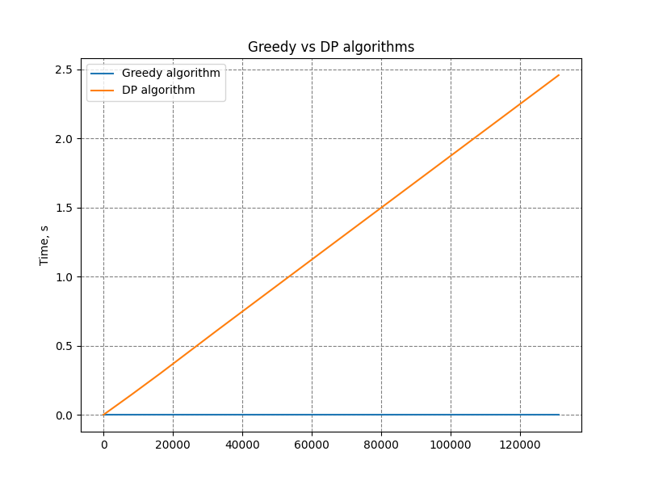
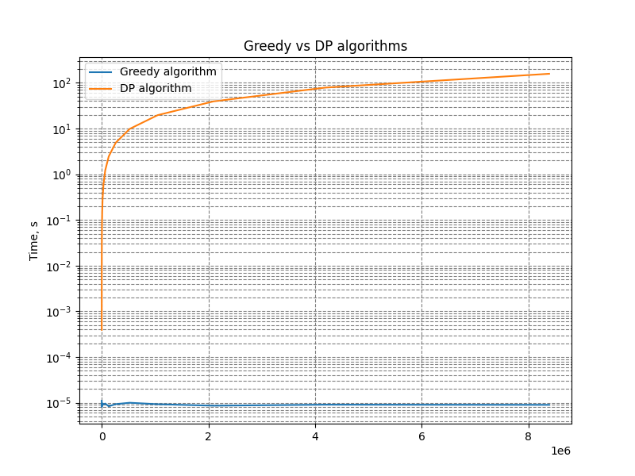

# Comparing Greedy and DP algorithms

Used [greedy](algorithms.py#L4-L11) and [DP](algorithms.py#L14-L34) algoritms, generated sum using 2^5-2^24.
Measued exetution time using `timeit` lib.

## Results 

According to plot, DP algoritm has linear O(n) complexity, greedy algoritm has much lower complexity - O(n*log(n)) or similar. For coin change task with huge sum greedy algoritm is preferable. 

